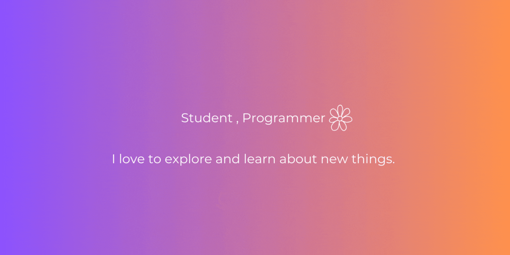

<h1 align="center"> 👋 </h1>

  

<h2 align="center"> 👩🏻‍💻 About Me</h2>

  <samp> A creative and passionate Computer Science student from the Philippines. I am an aspiring web developer with an extensive knowledge for front-end programming. 
  </samp>  
  <samp> Connect with me :D
  </samp>
     
  

<h2 align="center"> 🔭 Tech Stack</h2>

   &nbsp;&nbsp;&nbsp;
   &nbsp;&nbsp;&nbsp;
  &nbsp;&nbsp;&nbsp;
  &nbsp;&nbsp;&nbsp;
  &nbsp;&nbsp;

HTML, CSS , Javascript, Typescript, Java, Python, Bootstrap, ReactJS, Tailwind, SQL, Node.js, PostgreSQL, Django

<h2  align="center">📫 Reach me on</h2>

  &nbsp;&nbsp;&nbsp;&nbsp;
  &nbsp;&nbsp;&nbsp;&nbsp;
  &nbsp;&nbsp;&nbsp;&nbsp;

<h2  align="center">💻 Check Out My Repos ⬇️ </h2>
